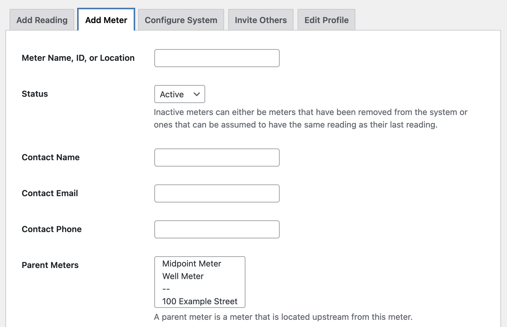
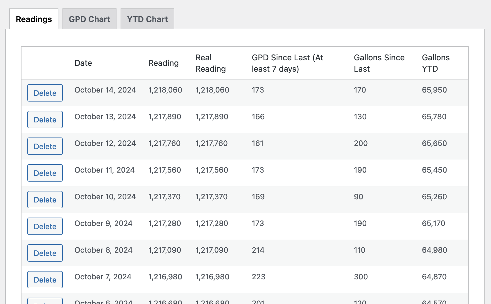
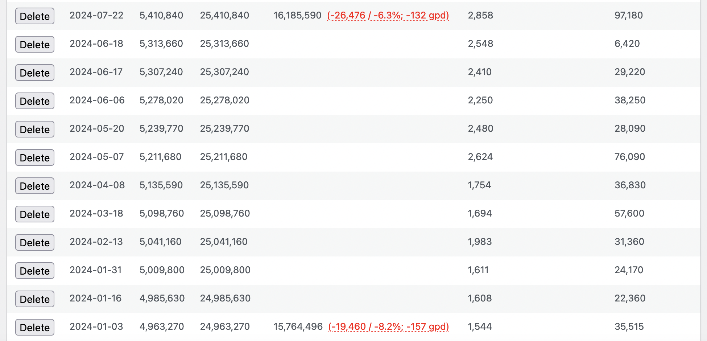

Metermaid
---------
Metermaid is a WordPress plugin that creates a dashboard for tracking water meter readings. This is especially useful if you are managing a community water system and need to track water usage across more than a few meters.

To get started, install Metermaid and then open the "Metermaid" menu item:

Click "Add Meter" to add your meters.

Once you enter meter readings, you will see charts showing gallons per day compared across years and gallons YTD compared across years.

Scroll down, and you'll see all previous readings.

What are child meters and parent meters?
----------------------------------------
A child meter is a meter that only counts usage that is already counted by a meter further upstream (the parent meter).

Imagine you have a well. At the well, there is a pump, and the pump pushes water to three houses. Directly after the pump, there is a meter that counts all gallons that the pump outputs. This is the parent meter. The three house meters are child meters. Their combined readings should equal the reading of the parent meter.

When you set up child and parent meters and then enter readings for all meters in a system on the same days, Metermaid will calculate how much water might be getting lost in the system, either through leaks or unmetered usage. For example, this real-world example shows a parent meter that measured 6.3% higher than the sum of its children meters across a six-month period.

This discrepancy could be due to unmetered water usage, inaccurate meters, or a leak in the distribution system.

What is a supplement?
---------------------
Supplements are a way to track water that is added to a system between a parent and a child meter.

Imagine you have a well, and a pump pumps water from the well into a holding tank, from which three houses draw. Your well pump breaks, so you have water delivered directly into your holding tank. Without tracking this supplementary water, it will appear that the houses have used more water than the well provided.

What is the difference between a reading and a "real reading"?
--------------------------------------------------------------
Imagine you have a water meter that reads `999999`. The next day, you check the meter, and it reads `000001`. Even though the meter shows a single gallon, its real reading is actually 1,000,001 gallons. Metermaid automatically calculates what the true reading of a meter is based on previous readings.

Real readings are recalculated any time you add or delete a reading, so adding historical meter data will only make them more accurate.

It is possible for the real reading to be wrong due to lack of data. If you read a 6-wheel meter on January 1 and it reads `500000` and then you check it again on February 1, and it reads `600000`, there's no way to know whether it measured 100,000 gallons or 1,100,000, and Metermaid will assume 100,000. If you added a reading from January 15 of `900000`, then Metermaid would correctly update the real reading to `1600000`.

Contact me with any questions: cfinke@gmail.com.